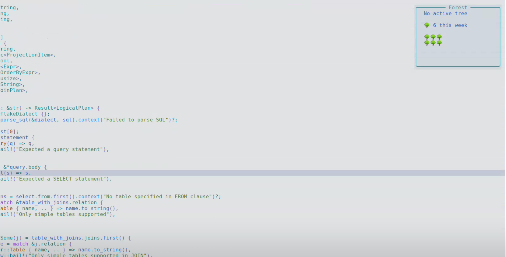

# 🌲 forest.nvim

A minimalist, gamified focus timer for Neovim, inspired by the Forest app. Plant a seed, stay focused, and grow your virtual forest right inside your editor! 

If you get distracted and stop interacting with Neovim, your tree will wither away. Stay focused, and at the end of the week, admire the beautiful forest you've built.

### Demo


*(If the video doesn't load in your viewer, here is a screenshot)*


## ✨ Features
- **Zero Dependencies**: Powered by a robust, built-in JSON backend (`~/.local/share/nvim/forest.json`). No external SQLite libraries required!
- **Weekly Tracking**: Your visual forest resets every Monday to keep things fresh, but your rich session history is kept safely forever in your JSON data file.
- **Minimalist UI**: 
  - `:ForestStart` opens a tiny, non-intrusive floating HUD (e.g., `🌱 04:59`) to keep you on track.
  - `:ForestDashboard` expands into a beautiful, dense grid visualization of your current week's forest.
- **Strict Activity Monitoring**: Your tree demands focus! It actively tracks keystrokes and cursor movements. Idling for too long will kill the sapling.

## 📦 Installation

With [lazy.nvim](https://github.com/folke/lazy.nvim):
```lua
{
  "vinvolve/forest.nvim",
  config = function()
    require("forest").setup()
  end
}
```

## ⚙️ Configuration

You can customize the timer durations and icons in your setup function. Here are the default values:

```lua
require("forest").setup({
  focus_target_minutes = 5,    -- Time required to fully grow a tree
  max_idle_seconds = 100,      -- Maximum time you can idle before the tree withers
  icons = {
    stages = { "🌰", "🌱", "🌿", "🌲" },
    tree = "🌳",
    dead = "🥀",
  }
})
```

## 🚀 Usage

- `:ForestStart` - Plant a new seed and open the minimal HUD. Stay focused!
- `:ForestDashboard` - Toggle the expanded dashboard to see your weekly forest grid.
- `:ForestStop` - Chop down your current sapling early and stop the timer.

